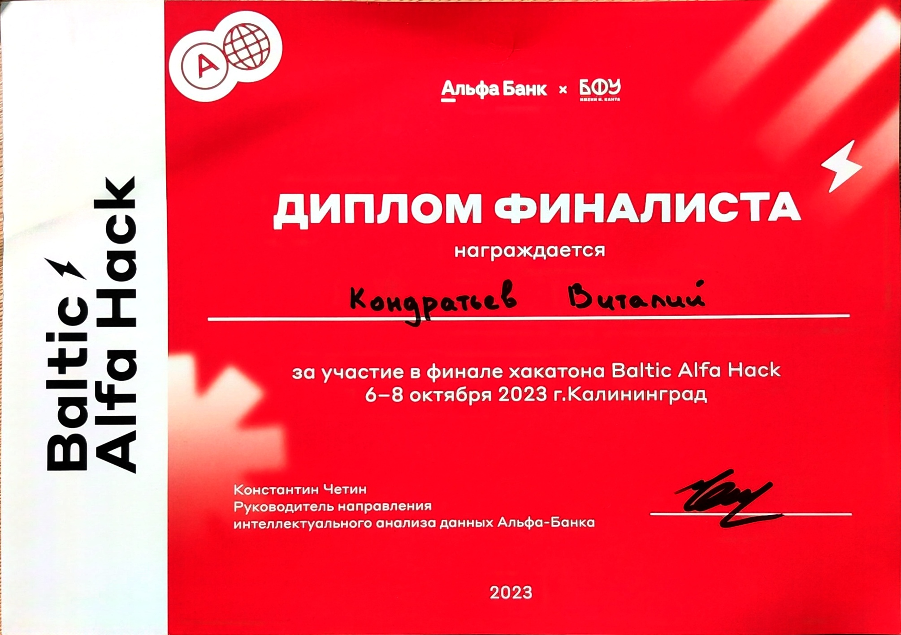

# Привет, меня зовут Виталий!

---

### :man_technologist: Обо мне:

Я начинающий разработчик в разных отраслях. . В IT вошёл ещё в 2019, когда захотелось попробовать пошаманить с исходниками игры, используя C# и Microsoft SQL Server Managment. После поступления в ВУЗ в 2021 году перешёл полноценно на C++, где успел поработать в небольшой фирме 9 месяцев, после чего я ушёл, потому что перспективы на рабочем месте не видел. Параллельно с обучением в ВУЗе начал изучать такие языки как Python, Java. В планах дальше подключиться к изучению нейронок

 6-8 октября 2023 года - финалист в хакатоне "Baltic Alfa Hack", где технологический фокус: Big Data и нейросети

 

 

- :mailbox: Как связаться со мной:  

---

### 🤝 Социальные сети:

  

    
    <!--  -->
  

---

### 🛠 Языки и инструменты:

    &nbsp;
   &nbsp;
  &nbsp;
  &nbsp;
  &nbsp;
  &nbsp;

---

